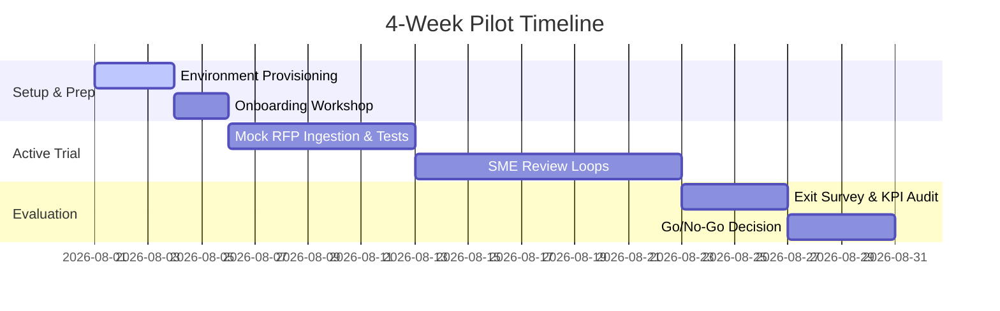

# RFP Architect - Pilot Proposal Template

**Prepared For:** [Customer Organization Name]  
**Prepared By:** RFP Architect Bid Team  
**Date:** [Date]  
**Version:** 1.0 (Staging Pilot Draft)

---

> [!NOTE]
> **DISCLAIMER:** This template is for commercial proposal drafting purposes. It is not a legal contract. Final proposals must undergo legal review by both parties prior to signature.

---

## 1. Problem Statement & Goals

[Customer Organization Name] has identified the following challenges in their current proposal process:
* **High SME Cost:** Subject Matter Experts spend excessive time drafting response text.
* **Compliance Risks:** Manual parsing of solicitations leads to compliance matrix errors.
* **Citations & Grounding:** Difficulty finding exact page numbers and evidence from previous proposals.

**Target Outcomes of Pilot:**
1. Reduce compliance matrix extraction time by **50%**.
2. Automate first-draft response generation using approved source evidence.
3. Establish a structured SME review workflow with full citation tracing.

---

## 2. Pilot Scope & Packages

* **Duration:** 4 Weeks (Standard Pilot)
* **Users:** Up to 10 active reviewer seats.
* **Features Included:** 
  * Requirement Extraction
  * Knowledge Document Upload (up to 50 documents)
  * AI-Assisted Drafting (FakeLLM / Production LLM depending on keys)
  * Human review and approved matrix export (DOCX/XLSX).
* **Pricing Flat Fee:** [Flat Fee, e.g., $5,000]

---

## 3. Timeline & Execution

---

## 4. Success Criteria

The pilot will be deemed successful and ready for commercial subscription if:
1. **Recall Rate:** Extraction recall rate is verified at **>= 90%** during audits.
2. **Drafting Time Reduction:** SME response drafting cycles are cut by **>= 30%**.
3. **Citation Integrity:** 100% of generated drafts match verified source snippets and page numbers.
4. **User CSAT:** Reviewers rate usability **>= 4.0 / 5.0** in the exit survey.

---

## 5. Security & Data Handling Overview

* **Isolation:** Individual customer workspaces are isolated at the database query layer.
* **Transit:** Ingested text is processed through secure API endpoints with enterprise zero-retention policies.
* **Storage:** Database backups are stored daily with encryption.
* **No Audited Compliance Certifications:** This environment is deployed for pilot staging and is not SOC 2 audited or HIPAA certified.

---

## 6. Exclusions

* Commercial hosting SLA guarantees are excluded during the pilot.
* Custom database integration and CRM workflows are excluded.
* Regulated payment card data (PCI) and medical health records (PHI) are prohibited.

---

## 7. Signatures & Approvals

By signing below, the parties agree to begin the 4-week staging pilot of RFP Architect:

**For Vendor:**  
Name: ______________________  
Title: ______________________  
Date: ______________________  

**For [Customer Organization Name]:**  
Name: ______________________  
Title: ______________________  
Date: ______________________  
