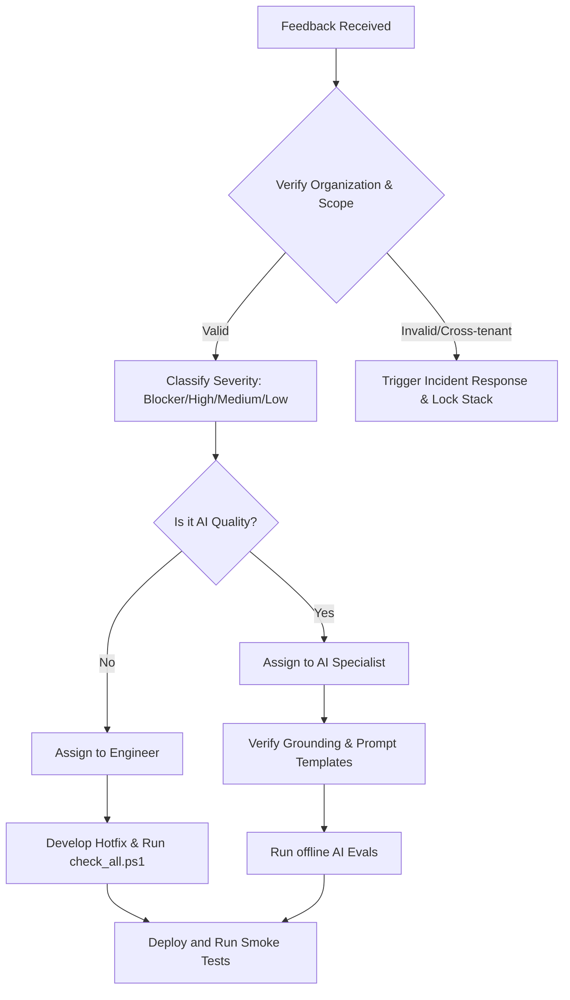

# RFP Architect MVP - Pilot Issue Triage Workflow

This document defines the severity levels, response targets, owner roles, and escalation paths for triaging issues reported during the customer pilot phase.

---

## 1. Severity Classifications & Response Targets

| Severity | Definition | Response Target | Resolution Target |
| :--- | :--- | :--- | :--- |
| **BLOCKER** | System is down; core workflow (upload, extract, review, export) is completely broken with no workaround. | < 30 minutes | < 4 hours |
| **HIGH** | Major feature is broken, but a manual workaround exists (e.g. background job fails on one specific file but works on others). | < 2 hours | < 24 hours |
| **MEDIUM** | Minor functionality issue or UI bug that does not prevent task completion (e.g., dashboard display alignment, pagination lag). | < 12 hours | < 3 business days |
| **LOW** | Cosmetic issues, spelling errors, or feature enhancement suggestions. | < 24 hours | Next release cycle |

---

## 2. Issue Categories

### AI Quality Bugs
AI-related bugs must be classified carefully to distinguish code errors from model parameters:
* **Hallucination Bug (High/Blocker):** The AI invents claims not present in the supporting evidence documents. *Action:* Check LLM system prompt filters, verify grounding parser, adjust threshold, or fallback to `NEEDS_EVIDENCE`.
* **Low Recall (High):** System fails to extract obvious requirements. *Action:* Adjust the chunking size or prompt extraction instructions.
* **Bad Formatting (Medium):** Markdown in draft is poorly compiled. *Action:* Standardize output formatting in `DraftResponse`.

### Security & Privacy Bugs
Any security bug is treated with the highest priority:
* **Tenant Leak (Blocker):** User sees projects or documents belonging to another organization. *Action:* Terminate server immediately, review SQLAlchemy query scopes, check session org verification, deploy hotfix before restart.
* **CSRF Violation (Blocker):** State-mutating routes accept payloads without valid session tokens. *Action:* Apply `Depends(validate_csrf_token)` to missing endpoints.

---

## 3. Owner Roles & Responsibilities
* **Triage Lead:** Het Patel (`support-pilot@yourorg.com`) — Reviews incoming feedbacks, classifies severity, assigns issues to developers, and updates tickets.
* **Lead Backend Engineer:** Primary contact for database connection drops, Redis task queue failures, and API errors.
* **AI Quality Specialist:** Primary contact for grounding failure reviews, recall audits, and LLM telemetry tracking.

---

## 4. Triage & Escalation Process

### Escalation Path
1. **Developer Triage:** Assigned engineer develops local fix and validates it using `check_all.ps1`.
2. **Review & Gate:** Changes are pushed to a hotfix branch; must pass the full GitHub Actions CI suite.
3. **Staging Rollout:** Deploy to staging and execute the rollback drill procedure (refer to [RUNBOOK.md](file:///D:/RFA/Project/rfp-architect-mvp/RUNBOOK.md)) if validation fails.
4. **Communication:** Inform the pilot coordinator to log client impact.
