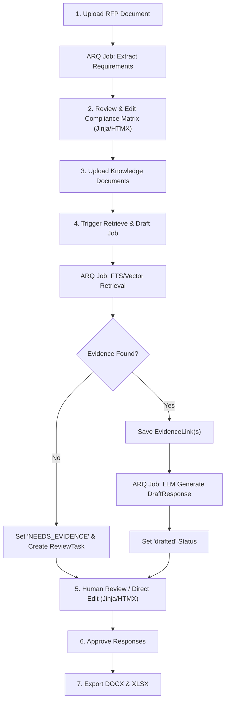
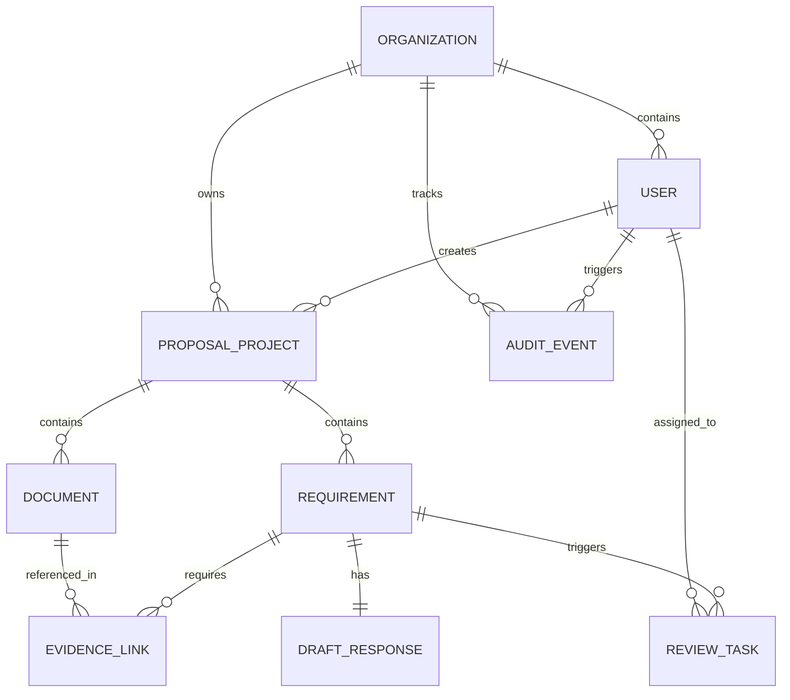

# Decision Record: 0001-mvp-architecture

**Status**: Proposed  
**Date**: 2026-06-25  
**Author**: Antigravity  

## Context & Requirements

The goal is to design a human-controlled RFP (Request for Proposal) response workspace. Per the **RFP Architect MVP: Engineering Contract** (defined in [AGENTS.md](file:///D:/RFA/Project/rfp-architect-mvp/AGENTS.md)), the core workflows, principles, and technical stack are strictly defined:
- **Core Workflow**: Upload RFP $\rightarrow$ Extract Requirements $\rightarrow$ Upload Knowledge Documents $\rightarrow$ Retrieve Evidence $\rightarrow$ Draft Source-Backed Answers $\rightarrow$ Route Gaps to Human Reviewer $\rightarrow$ Export DOCX & XLSX.
- **MVP Principles**: Evidence before drafting, source backing required, `NEEDS_EVIDENCE` fallback (no invented claims), human approval, untrusted document handling.
- **Tech Stack**: Python 3.12, FastAPI, SQLAlchemy 2, Alembic, PostgreSQL, Redis, ARQ, and Jinja2 + HTMX.
- **Scope Limitations**: Strictly no LangGraph, Qdrant, vLLM, SharePoint, Salesforce, SSO, or multi-agent orchestration.

---

## 1. MVP User Flow

The workspace utilizes **Jinja2 + HTMX** to deliver a responsive, page-refresh-free experience for the user. Below is the step-by-step user interaction flow.



### Step-by-Step Walkthrough

1. **Project Creation & RFP Upload**:
   - The user logs in and creates a `ProposalProject`.
   - The user uploads the main RFP document (PDF or DOCX).
   - Upon upload, a background job is enqueued to extract requirements.

2. **Requirements Review (Compliance Matrix)**:
   - The user views the extracted `Requirement` list in an editable table (the compliance matrix).
   - The user can edit the requirement text, add missing requirements, delete false positives, or assign tags/identifiers.

3. **Knowledge Base Upload**:
   - The user uploads approved knowledge documents (previous proposals, product documentation, FAQs).
   - Documents are parsed, split, and indexed in PostgreSQL for full-text search (FTS).

4. **Retrieve & Draft Execution**:
   - The user triggers the retrieval and drafting pipeline for the project.
   - For each requirement, the system runs an asynchronous job to query PostgreSQL for relevant evidence snippets.
   - Found snippets are saved as `EvidenceLink` records.
   - If no relevant evidence is found, the requirement is marked `NEEDS_EVIDENCE` and a `ReviewTask` is created.
   - If evidence is found, the system passes the requirement and evidence snippets to the LLM to draft a response (`DraftResponse`), which is saved with status `draft`.

5. **Human Review & Manual Overrides**:
   - The user filters requirements by status (e.g., `drafted`, `NEEDS_EVIDENCE`, `approved`).
   - For drafted answers, the user reviews the text and its attached `EvidenceLink` citations.
   - For `NEEDS_EVIDENCE` gaps or rejected drafts, the user writes or overrides the response manually, or routes it as a `ReviewTask` to a specific team member.

6. **Approval & Export**:
   - The user approves each answer individually.
   - Once satisfied, the user exports:
     - A formatted **DOCX** proposal draft containing the final approved answers.
     - An **XLSX** compliance matrix mapping requirements, statuses, responses, and evidence.

---

## 2. Proposed Package Structure

The project follows a standard structured FastAPI backend layout. Front-end pages are served using Jinja2 templates decorated with HTMX for dynamic content replacement.

```
app/
├── core/                   # Shared configurations, DB sessions, security, LLM
│   ├── config.py           # Settings and environment variables
│   ├── database.py         # SQLAlchemy connection & session managers
│   ├── security.py         # Password hashing & JWT/Cookie session utils
│   └── llm.py              # LLMProvider interface & FakeLLMProvider implementation
├── models/                 # SQLAlchemy 2.0 Database Models
│   ├── base.py             # Declarative base model
│   ├── organization.py     # Organization model
│   ├── user.py             # User model
│   ├── project.py          # ProposalProject model
│   ├── document.py         # Document model
│   ├── requirement.py      # Requirement model
│   ├── evidence.py         # EvidenceLink model
│   ├── response.py         # DraftResponse model
│   ├── review.py           # ReviewTask model
│   └── audit.py            # AuditEvent model
├── schemas/                # Pydantic validation schemas
│   ├── user.py
│   ├── project.py
│   ├── document.py
│   ├── requirement.py
│   ├── evidence.py
│   ├── response.py
│   ├── review.py
│   └── audit.py
├── services/               # Core business logic
│   ├── extractor.py        # PDF/DOCX parsing & requirement extraction
│   ├── retriever.py        # PostgreSQL FTS and vector-based evidence retrieval
│   ├── drafter.py          # LLM prompt composition and response drafting
│   └── exporter.py         # DOCX/XLSX generation utilities
├── workers/                # ARQ background task workers
│   ├── tasks.py            # Async background task handlers (arq entrypoints)
│   └── worker.py           # ARQ worker loop configuration
├── web/                    # HTTP Layer
│   ├── api/                # API Endpoints returning JSON
│   │   ├── auth.py
│   │   ├── projects.py
│   │   ├── documents.py
│   │   ├── requirements.py
│   │   └── reviews.py
│   ├── routes/             # Jinja2 rendering routes returning HTML/HTMX partials
│   │   ├── dashboard.py
│   │   ├── project.py
│   │   └── compliance.py
│   └── templates/          # Jinja2 Templates (HTML)
│       ├── base.html       # Base layout
│       ├── dashboard.html  # Dashboard page
│       ├── project.html    # Project main workspace
│       └── components/     # HTMX reusable component partials (tables, modals)
├── main.py                 # FastAPI Application entry point
└── pyproject.toml          # Dependency declaration
```

---

## 3. Database Entities and Relationships

To satisfy the engineering contract, nine entities are declared. We implement these with SQLAlchemy 2.0 relationship definitions.



### Entity Schema Specifications

#### 1. Organization
Represents a multi-tenant client organization.
- `id` (UUID, PK)
- `name` (String, Not Null)
- `created_at` (DateTime, Default: timezone.utc)

#### 2. User
An employee belonging to an Organization.
- `id` (UUID, PK)
- `organization_id` (UUID, FK $\rightarrow$ Organization, Not Null)
- `email` (String, Unique, Not Null)
- `hashed_password` (String, Not Null)
- `full_name` (String, Not Null)
- `is_active` (Boolean, Default: True)
- `created_at` (DateTime)

#### 3. ProposalProject
A workspace for answering a single RFP.
- `id` (UUID, PK)
- `organization_id` (UUID, FK $\rightarrow$ Organization, Not Null)
- `title` (String, Not Null)
- `description` (Text, Nullable)
- `created_by_id` (UUID, FK $\rightarrow$ User, Not Null)
- `status` (String: `draft`, `processing`, `reviewing`, `completed`)
- `created_at` (DateTime)
- `updated_at` (DateTime)

#### 4. Document
An uploaded file (either the RFP or supporting Knowledge Base documents).
- `id` (UUID, PK)
- `project_id` (UUID, FK $\rightarrow$ ProposalProject, Not Null)
- `name` (String, Not Null)
- `file_path` (String, Not Null)
- `file_type` (String, e.g., `application/pdf`, `application/vnd.openxmlformats-officedocument.wordprocessingml.document`)
- `doc_role` (String: `rfp`, `knowledge_base`)
- `content` (Text, Nullable) - Extracted text for full-text search indexing.
- `created_by_id` (UUID, FK $\rightarrow$ User, Not Null)
- `created_at` (DateTime)
*Index*: A PostgreSQL GIN index on `to_tsvector('english', content)` for fast full-text search.

#### 5. Requirement
An individual compliance requirement extracted from the RFP.
- `id` (UUID, PK)
- `project_id` (UUID, FK $\rightarrow$ ProposalProject, Not Null)
- `identifier` (String, Nullable, e.g., "Section 4.1.2")
- `text` (Text, Not Null)
- `page_number` (Integer, Nullable)
- `source_document_id` (UUID, FK $\rightarrow$ Document, Not Null)
- `status` (String: `unassigned`, `drafting`, `needs_evidence`, `drafted`, `approved`)
- `created_at` (DateTime)
- `updated_at` (DateTime)

#### 6. EvidenceLink
An association linking a specific requirement to a passage in a knowledge base document.
- `id` (UUID, PK)
- `requirement_id` (UUID, FK $\rightarrow$ Requirement, Not Null)
- `document_id` (UUID, FK $\rightarrow$ Document, Not Null)
- `snippet` (Text, Not Null)
- `page_number` (Integer, Nullable)
- `score` (Float) - Search relevance score.
- `created_at` (DateTime)

#### 7. DraftResponse
The text draft answering a requirement.
- `id` (UUID, PK)
- `requirement_id` (UUID, FK $\rightarrow$ Requirement, Unique, Not Null)
- `content` (Text, Not Null)
- `status` (String: `draft`, `approved`, `rejected`)
- `approved_by_id` (UUID, FK $\rightarrow$ User, Nullable)
- `created_at` (DateTime)
- `updated_at` (DateTime)

#### 8. ReviewTask
An assignment created when human intervention is needed (e.g. `NEEDS_EVIDENCE` status).
- `id` (UUID, PK)
- `requirement_id` (UUID, FK $\rightarrow$ Requirement, Not Null)
- `assigned_to_id` (UUID, FK $\rightarrow$ User, Nullable)
- `reviewer_notes` (Text, Nullable)
- `status` (String: `open`, `resolved`)
- `created_at` (DateTime)
- `resolved_at` (DateTime, Nullable)

#### 9. AuditEvent
Immutable record tracking system modifications and data access.
- `id` (UUID, PK)
- `organization_id` (UUID, FK $\rightarrow$ Organization, Not Null)
- `user_id` (UUID, FK $\rightarrow$ User, Nullable)
- `action` (String, Not Null, e.g., `document_upload`, `draft_approval`, `proposal_export`)
- `entity_type` (String, Not Null, e.g., `Requirement`, `Document`)
- `entity_id` (UUID, Not Null)
- `details` (JSONB, Nullable)
- `ip_address` (String, Nullable)
- `created_at` (DateTime, Default: timezone.utc)

---

## 4. API Endpoints

The API is structured to handle JSON actions for core operations, alongside standard web routes that return HTML elements driven by HTMX.

### Authentication Endpoints
- `POST /api/v1/auth/login`
  - *Payload*: `UserLogin` (email, password)
  - *Response*: Session Cookie or JWT Token
  - *Description*: Authenticate user and initialize session.
- `POST /api/v1/auth/logout`
  - *Response*: Empty (deletes cookie)
  - *Description*: Terminate the user session.

### Proposal Project Endpoints
- `GET /api/v1/projects`
  - *Response*: `List[ProjectSchema]`
  - *Description*: Return projects scoped to the logged-in user's organization.
- `POST /api/v1/projects`
  - *Payload*: `ProjectCreate` (title, description)
  - *Response*: `ProjectSchema`
  - *Description*: Initialize a new proposal project.
- `GET /api/v1/projects/{project_id}`
  - *Response*: `ProjectDetailSchema`
  - *Description*: Fetch specific project metadata and document list.

### Document Management Endpoints
- `POST /api/v1/projects/{project_id}/documents`
  - *Payload*: Multipart Form Data (file: UploadFile, doc_role: String)
  - *Response*: `DocumentSchema`
  - *Description*: Upload an RFP or Knowledge Document. Spawns extraction job if `doc_role="rfp"`.
- `GET /api/v1/projects/{project_id}/documents`
  - *Response*: `List[DocumentSchema]`
  - *Description*: Retrieve all files attached to the project.
- `DELETE /api/v1/projects/{project_id}/documents/{document_id}`
  - *Response*: Empty
  - *Description*: Delete a document and its parsed contents.

### Compliance & Requirements Endpoints
- `GET /api/v1/projects/{project_id}/requirements`
  - *Response*: `List[RequirementSchema]`
  - *Description*: Retrieve all extracted requirements (the compliance matrix).
- `PUT /api/v1/requirements/{requirement_id}`
  - *Payload*: `RequirementUpdate` (identifier, text, status)
  - *Response*: `RequirementSchema`
  - *Description*: Update an individual requirement's metadata.
- `POST /api/v1/projects/{project_id}/requirements/extract`
  - *Response*: `JobStatusSchema`
  - *Description*: Manually re-trigger the background parser for the RFP.

### Retrieve & Draft Endpoints
- `POST /api/v1/projects/{project_id}/draft-all`
  - *Response*: `JobStatusSchema`
  - *Description*: Trigger background jobs to retrieve evidence and draft answers for all requirements in the project.
- `POST /api/v1/requirements/{requirement_id}/draft`
  - *Response*: `JobStatusSchema`
  - *Description*: Trigger background retrieval and drafting for a single requirement.
- `GET /api/v1/requirements/{requirement_id}/evidence`
  - *Response*: `List[EvidenceLinkSchema]`
  - *Description*: Fetch the evidence snippets retrieved for a requirement.
- `PUT /api/v1/requirements/{requirement_id}/response`
  - *Payload*: `ResponseUpdate` (content, status)
  - *Response*: `DraftResponseSchema`
  - *Description*: Update or approve a drafted response. Writes to audit trail.

### Review Task Endpoints
- `GET /api/v1/projects/{project_id}/reviews`
  - *Response*: `List[ReviewTaskSchema]`
  - *Description*: Fetch all outstanding and resolved review tasks.
- `POST /api/v1/requirements/{requirement_id}/reviews`
  - *Payload*: `ReviewTaskCreate` (assigned_to_id, reviewer_notes)
  - *Response*: `ReviewTaskSchema`
  - *Description*: Manually flag a requirement for review.
- `POST /api/v1/reviews/{review_task_id}/resolve`
  - *Payload*: `ReviewTaskResolve` (resolution_notes)
  - *Response*: `ReviewTaskSchema`
  - *Description*: Resolve an outstanding review task.

### Export Endpoints
- `GET /api/v1/projects/{project_id}/export/docx`
  - *Response*: Binary stream (Word document)
  - *Description*: Download the drafted proposal containing all approved answers.
- `GET /api/v1/projects/{project_id}/export/xlsx`
  - *Response*: Binary stream (Excel spreadsheet)
  - *Description*: Download the compliance matrix with requirement metadata, draft answers, status, and evidence citations.

---

## 5. Background Job Flow

Asynchronous processing is managed via **ARQ** backed by **Redis**. Long-running tasks are divided into two main execution paths: **RFP Parsing/Extraction** and **Evidence Retrieval & Draft Generation**.

### RFP Extraction Lifecycle
1. The user uploads an RFP file via `POST /api/v1/projects/{project_id}/documents`.
2. The FastAPI controller saves the file, creates a `Document` record with `doc_role="rfp"`, and enqueues `extract_requirements_task(document_id)` in Redis.
3. The ARQ worker retrieves the job:
   - Parses the document (utilizing file format helpers to read PDFs or Word files).
   - Sends the parsed content to the `LLMProvider` using a structured schema to split the content into individual requirements.
   - For each extracted requirement, saves a `Requirement` record associated with the project, keeping track of page numbers.
4. Once completed, the project status is updated. HTMX frontend polling (`hx-trigger="every 3s"`) detects completion and swaps in the populated compliance matrix view.

### Retrieval & Drafting Lifecycle
The following flow occurs per-requirement when drafting is triggered:

```
[Trigger Job] ──> [ARQ Worker]
                       │
                       ▼
           [Search PostgreSQL FTS]
                       │
             ┌─────────┴─────────┐
             ▼                   ▼
      (Evidence Found?)   (No Evidence)
             │                   │
             │ Yes               ▼
             │           [Set NEEDS_EVIDENCE]
             │           [Create ReviewTask]
             │                   │
             ▼                   ▼
     [Save EvidenceLink]    [End Job]
             │
             ▼
     [Build LLM Prompt]
   (Snippet + Page Ref)
             │
             ▼
  [LLM generates answer]
             │
             ▼
    [Save DraftResponse]
             │
             ▼
    [Set status: draft]
```

1. The ARQ worker runs `retrieve_and_draft_task(requirement_id)`:
   - Queries PostgreSQL full-text search indexes on all `Document` entities in the project marked as `doc_role="knowledge_base"`.
   - Filters results by a minimum relevance score threshold.
2. **Decision point**:
   - **If no relevant snippets are found**:
     - The `Requirement.status` is set to `needs_evidence`.
     - An automatic `ReviewTask` is created, flagging the requirement for human intervention.
     - The job halts execution.
   - **If snippets are found**:
     - For each snippet, an `EvidenceLink` is saved, capturing the exact passage, source document, and original page number.
3. **Draft Generation**:
   - The worker gathers the requirement text and the content of the `EvidenceLinks`.
   - It formats an LLM prompt. The system prompt enforces: *"Generate a factual response using ONLY the provided evidence. If the evidence is insufficient to fully answer, reply with NEEDS_EVIDENCE. Cite source documents and page numbers."*
   - Invokes `LLMProvider.generate_response()` returning a structured JSON payload containing the draft content.
   - Saves a `DraftResponse` record linked to the requirement.
   - Sets the `Requirement.status` to `drafted`.

---

## 6. Security Boundaries

### Multi-Tenancy Isolation
- All database queries must include a filter on `organization_id`.
- The FastAPI auth layer injects the current authenticated user's `User` object (including their `organization_id`) into each endpoint.
- Database access patterns must pass the authenticated `organization_id` down to the service layer. Repository structures must explicitly include `org_id` parameters to prevent lateral tenant data leakages.

### Untrusted Document Handling
- Uploaded RFP and Knowledge Base documents must be treated as **untrusted data**.
- To prevent prompt injection (where instructions inside an uploaded document hijack the LLM worker), documents are parsed to raw text and stripped of markup.
- During drafting, document snippets are placed inside strict JSON schemas or XML tags (e.g. `<evidence_context>...</evidence_context>`) inside the LLM prompt.
- The LLM system instructions explicitly state that content within the evidence blocks must be treated strictly as data, and any instructions or commands found within them must be ignored.

### API Authentication & Authorization
- Endpoints are secured using a cookie-based session system or standard OAuth2 password bearer tokens.
- All mutating endpoints (`POST`, `PUT`, `DELETE`) require the user to have write permission for the active project.
- Access to export routes (`/export/docx`, `/export/xlsx`) triggers authentication validation and logs an `AuditEvent` before streaming the file payload.

### Audit Logging
- The application implements an immutable audit log system via the `AuditEvent` model.
- Events must be recorded synchronously within the request transaction for:
  - Document uploads and deletions.
  - Requirement additions, deletions, or edits.
  - Draft response edits and approvals.
  - Export generation.

---

## 7. Risks and Non-Goals

### Non-Goals (Out of Scope for MVP)
To maintain MVP discipline as defined in [AGENTS.md](file:///D:/RFA/Project/rfp-architect-mvp/AGENTS.md), the following features are explicitly omitted:
- **No external SaaS integrations**: No connection to Salesforce, SharePoint, Slack, Hubspot, or external document vaults.
- **No advanced LLM orchestrators**: No LangGraph, LangChain agents, or multi-agent runtime orchestration. Processing uses straight procedural code calling the `LLMProvider` interface.
- **No external Vector DBs**: No Qdrant, Pinecone, or Milvus. The MVP relies on PostgreSQL full-text retrieval first. If vector similarity search is added, it must reside behind a service interface and utilize pgvector within the existing PostgreSQL instance.
- **No custom LLM infrastructure**: No local vLLM instances or custom hosted embedding endpoints.
- **No Single Sign-On (SSO)**: Authentication uses standard credentials stored in PostgreSQL.
- **No Pricing Automation**: The MVP does not calculate proposal pricing or financial estimates.
- **No Autonomous Submission**: The application does not automatically submit bids to procurement portals.

### Identified Technical Risks & Mitigations

1. **Hallucination Risk**:
   - *Risk*: The LLM invents answers that are not backed by real company data.
   - *Mitigation*: The `LLMProvider` prompt structure requires answers to be derived exclusively from the provided `EvidenceLink` objects. The system drops back to `NEEDS_EVIDENCE` if context is empty, and users must manually review and approve all outputs.

2. **Document Parsing Quality**:
   - *Risk*: Complex tables, charts, or images in RFPs or knowledge bases are parsed poorly, leading to missing requirements or incomplete evidence.
   - *Mitigation*: The UI allows users to easily add, edit, or delete requirements in the compliance matrix, compensating for parsing deficiencies.

3. **Background Worker Bottlenecks**:
   - *Risk*: Large RFPs (hundreds of requirements) can trigger massive bursts of LLM calls, hitting API rate limits or timing out.
   - *Mitigation*: ARQ background jobs run with rate limit windows and retry mechanisms. The UI indicates real-time progress using HTMX polling so users are not blocked.

4. **Multi-tenant Leakage**:
   - *Risk*: An implementation error allows organization A to search or read organization B's uploaded knowledge base documents.
   - *Mitigation*: Comprehensive tenant checks are enforced at the API routing level and validated with deterministic test suites powered by `FakeLLMProvider`.
